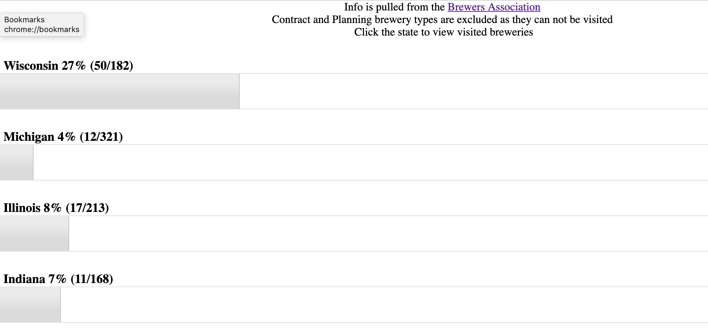

# Brewery List

This simple HTML page that reads in the list of breeries from the Brewers Associatin and then pulls in a count of breweries from the same gogole sheet that Brewery Map uses. It then display the percentage of bereries visited per state.

## API Key and Sheet ID

To run this as is you will need to populate your API_KEY and SHEET_ID. This project populates them in the `local_api_key.js` file

```
var API_KEY = "API_KEY";
var SHEET_ID = "SHEET_ID";
```

## The Google Sheet

The Google sheet is formatted as below. The first column does not matter and is ignored. The second column is used to extract the states whcih are used to pull down the list from Breweres Association. This must also have a state abbreviation in the array. Every row after that is a unique brewery found in the state that is contained at the top of the column. Blank cells are fine and are also ignored.

You can adjust the columns/rows in the API call that is used to fetch the data if your sheet varries. 


## Site

Pretty basic site - it will list the name of the state, a progress bar with the percentage of breweries visited, and if you click on the name of the state it will list the breweries visited.

Couple additional notes about the way the page works
- Each state has an ignore list for the brewers association data - This is used to remove duplicates
- Each state has an ignore list for the google sheet - This is use to remove any closed breweries
- We filte rout contract brewers and breweries in planning since they can't be visited
- If a brewery is close it will appear red in the list - this is pull from the google sheet exception list

The site will look like the below.



## Map
[Map README](html/map/README.md)
