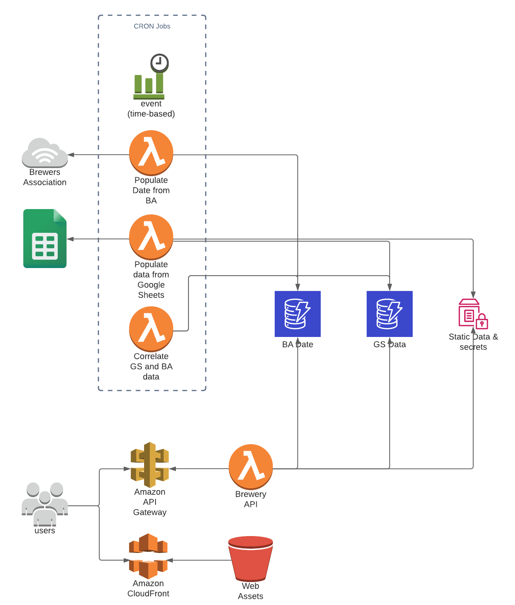

# Brewery List App

This is an app that was built to display all of the breweries that I have been to and compare them with the total list from the [Brewers Association](https://www.brewersassociation.org/directories/breweries).

This app uses several cron jobs to fetch and cache the data into DynamoDB and then builds an API layer on top of that cached data.

## Brewers Association Cron
This cron fetch data from the Brewers Association website ([json file](https://www.brewersassociation.org/wp-content/themes/ba2019/json-store/breweries/breweries.json)). It does some filtering of the data like only storing US breweries and removing breweries in the planning stage. It then stores all of that data into DynamoDB.

## Google Sheet Cron
This cron will fetch the names of the breweries I have visited which i store in google sheets. It will store these names and their associate states into DynamoDN. The Google Sheet looks like the below.

This cron also requires API_KEYs and SHEET_IDs. These are stored in parameter store currently.

## BA & GS Linking
This cron job will take the data from both DynamoDB table and compare it. It does this in 2 ways.

1) If there is a breweryID in the GS Dynanmo table, it will copy the related data from the BA table into the GS table
2) If there is no id found, then it will query for the name of the brewery from GS table in the BA table to try and find a match. It will use several variations of the name when searching. If it finds a match it will copy the related data.

If any of the matches are found, it will also store a status of `match_found` in the table to keep track of which ones have matched and which ones have not.

## Deployment
All deployments for this repo are done through CodeBuild

## Architecture

